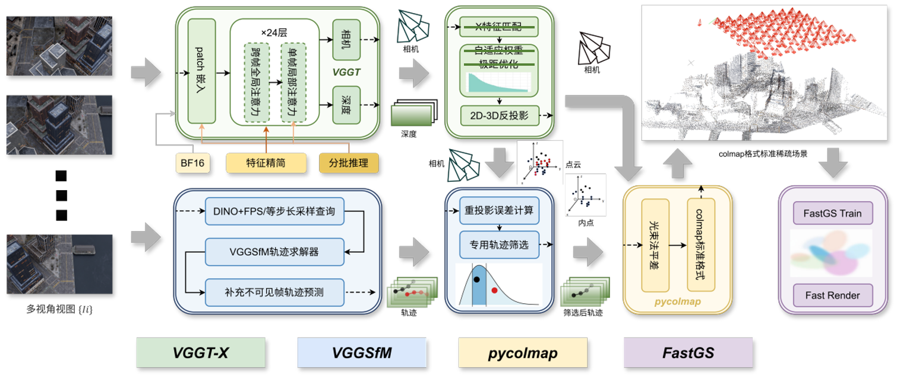
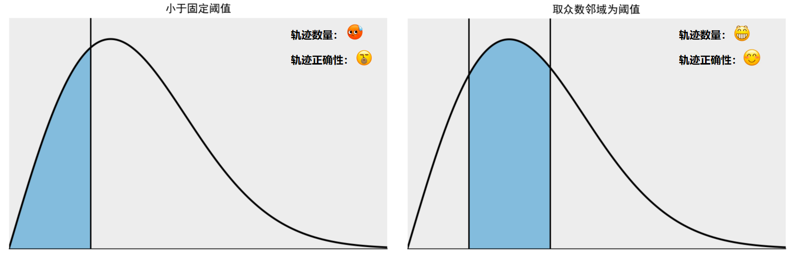
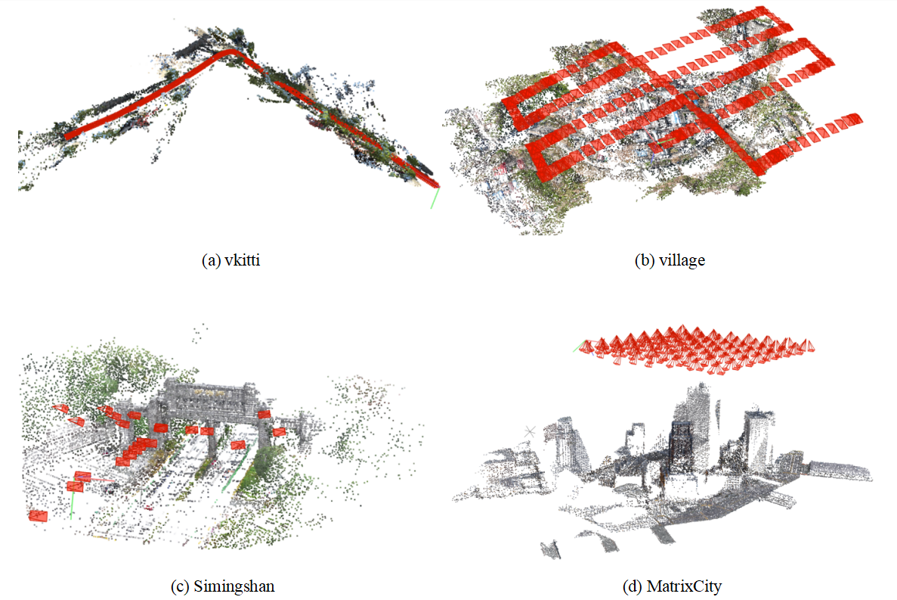

# VGGT-X + BA with Large-Scale Support

本项目在 [VGGT‑X](https://github.com/Linketic/VGGT-X) 和 [VGGT](https://github.com/facebookresearch/vggt) 的基础上，实现了**支持更大数据量输入的联合推理与 BA 优化**。  
主要改进包括：

- 🚀 **模型推理轻量化**：采用 VGGT‑X 的内存高效设计，降低显存占用，可处理更多帧（例如 200+ 帧）。这一部分我们完全复用 VGGT-X 的代码做推理。
- 🎯 **更鲁棒的轨迹过滤**：我们设计了一个更加鲁棒可靠的方法对 VGGSfM 预测轨迹进行筛选，保证 BA 优化在复杂场景下的稳定性。

## 1.过程展示

<!-- 在这里放一张你运行结果的效果图，比如重建的点云或者轨迹图像 -->
<p align="center">
  
  <br>
  <em>图1：our pipeline </em>
</p>

## 2.主要改进

BA 优化离不开轨迹信息，而 VGGSfM 预测的海量轨迹必定需要经过一个筛选。在 VGGT 的 demo 中这个筛选过程主要是根据重投影误差进行的：重投影误差大则认为是误匹配，删除，仅保留阈值内的点作为候选轨迹。

但是我们发现在一些数据集上 VGGT 模型推理出的相机参数本身就有显著的误差，这一误差的存在会为从头应该误差计算引入系统性误差，并且这一误差对当前相机参数有“偏好”。基于此，我们更换了一个新的轨迹过滤策略：
- ① 单独统计每一帧的来自不同查询帧的轨迹的重投影误差分布。
- ② 选取轨迹数最多的一个分布视作该帧的“主分布”，其余分布视作该帧的“次分布”。轨迹数不到主分布一半的次分布将被删除。
- ③ 对于每个分布，将其重投影误差分布核密度峰值点领域范围内的点，视作正确内点，每个有效分布单独筛选。

我们针对相机误差对重投影分布的影响进行过比较系统性的数学建模与仿真，并且对这一策略进行了实验验证，这些结果在一定程度上验证了这一改进的有效性，尤其在 VGGT 相机预测不准的场景下。

<p align="center">
  
  <br>
  <em>图2：原始轨迹过滤策略 vs 新的轨迹过滤策略 </em>
</p>

## 3.效果展示

原本面临显存OOM、面临 BA 内点不足失败的无人机数据集，都可以用我们的 pipeline 跑通。
<p align="center">
  
  <br>
  <em>图3：一些稀疏重建结果的 COLMAP GUI 展示</em>
</p>

## 4.安装

### 环境要求
- Python ≥ 3.10
- CUDA 11.8
- 推荐至少 24GB 显存

### 4.1 克隆仓库
```bash
git clone https://github.com/Warden4/vggt-x-ba-large.git
cd vggt-x-ba-large
```

### 4.2 创建 conda 虚拟环境并安装依赖
```bash
conda create -n vggt_ba python=3.10 -y
conda activate vggt_ba
pip install -r requirements.txt
```

## 5.快速开始

### 5.1 数据准备

数据准备非常简单，只需将待重建的图像（png、jpg、JPG等）放在一个文件夹内，目录结构如下：
```
your_scene_name/
    └── images/
        ├── 0001.jpg
        ├── 0002.jpg
        ├── 0003.jpg
        └── ...
```
### 5.2 运行

以我们直接提供的 Village 场景为例：
```bash
# 进行 VGGT-X 轻量推理
python step1_inference.py --scene_dir examples/Village --output_dir examples/Village
# 进行 VGGSfM 轨迹预测与 BA 优化
python step2_run_ba.py \
    --scene_dir examples/Village \
    --chunk_path examples/Village/vggt_x_for_ba.npy
```
如果一切顺利，你可以看到输出结果：
```
Village/
    └── images/
        ├── 0001.jpg
        ├── 0002.jpg
        ├── 0003.jpg
        └── ...
    └── sparse/
        ├── points3D.bin
        ├── points.ply
        ├── images.bin
        └── cameras.bin
    └── vggt_x_for_ba.npy
```

## 6 致谢

这是本人的本科毕业设计，设计与实现中也许存在许多潦草或者不规范的地方，如果对您造成了困扰我将深表歉意，如果这一工作能够对您有任何的启发或帮助，我将倍感荣幸。
非常感谢我的老师和同学们，也非常感谢 [VGGT](https://github.com/facebookresearch/vggt)、[VGGT-X](https://github.com/Linketic/VGGT-X)、[VGGSfM](https://github.com/facebookresearch/vggsfm)、[FastGS](https://github.com/google/fastgs) 等工作，本人毕业设计的实现离不开他们优秀的工作成果。
